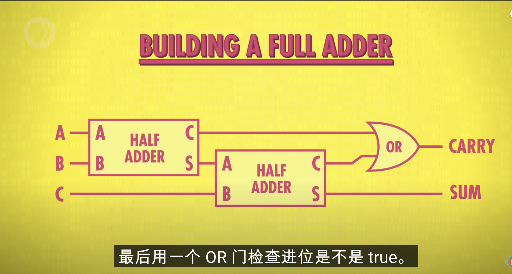
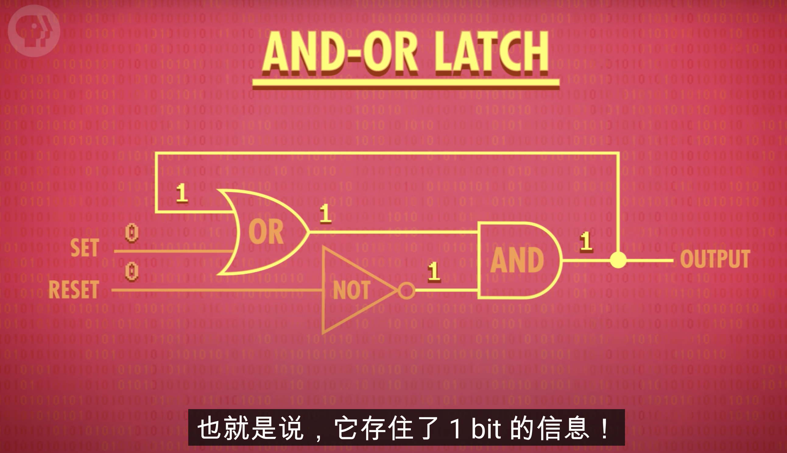

[TOC]
# Early Computing: Crash Course Computer Science #1
最早用算盘，然后用齿轮，十个齿的齿轮。然后二战的时候有人发明了差分机用来计算三角函数之类的
美国人口普查的时候发明了打孔机
# Electronic Computing: Crash Course Computer Science #2
人们用继电器控制电路，但是继电器容易损坏，开关速度也慢。
真空管代替了继电器，通过正电流和负电流来控制，只有正电流才会亮，但是造价太昂贵
图灵发明了bombe机器破解纳粹的Enigma
ENIAC
然后用晶体管
# Representing Numbers and Letters with Binary: Crash Course Computer Science #3
晶体管非，是在输入的地方连接一条线路，当作output
晶体管与门是两个晶体管串联，或门是两个晶体管并联

# Representing Numbers and Letters with Binary: Crash Course Computer Science #4
一字节等于8bit

第一个bit表示正负数，1表示负数，0表示正数

ASCII用数字表示字母，unicode统一编码

# How Computers Calculate - the ALU: Crash Course Computer Science #5
alu是计算机核心，用于计算。有两个单元，一个算术单元，一个逻辑单元
用异或门来计算加法。半加器(half adder)是异或门与与门并联
full adder

8-bit adder
one half adder and seven full adder
溢出就是数太大超出了范围，比如数字相加后最大的那个数超出了这个计算器计算范围

# Registers and RAM: Crash Course Computer Science #6

AND-OR LATCH 可以存1bit
寄存器的实现方法，堆多一些就是内存了

# The Central Processing Unit (CPU): Crash Course Computer Science #7
cpu需要四个寄存器，以及一个指令寄存器，还有一个指令地址寄存器
第一步读指令，指令地址寄存器通过存放的地址去内存获取指令
第二部解码，指令寄存器前四位是操作码，有检查电路对操作码进行检验
第三步执行指令 比如加载指令，识别操作码电路去内存获取对应地址的值，然后将值加载到寄存器中

指令寄存器、指令地址寄存器、操作码识别并执行电路组成控制单元

cpu根据程序需求可以增加或者减少运行频率，通过控制时钟，叫做动态时钟频率调整

# Instructions & Programs: Crash Course Computer Science #8
 改变程序执行顺序或者跳过一些指令可以使用jump指令，jump 加地址，就直接跳到那个地址
 halt指令让程序停止，不然cpu会继续按照内存读下去
 jump_neg 当值为负数的时候则跳转到指定内存位置