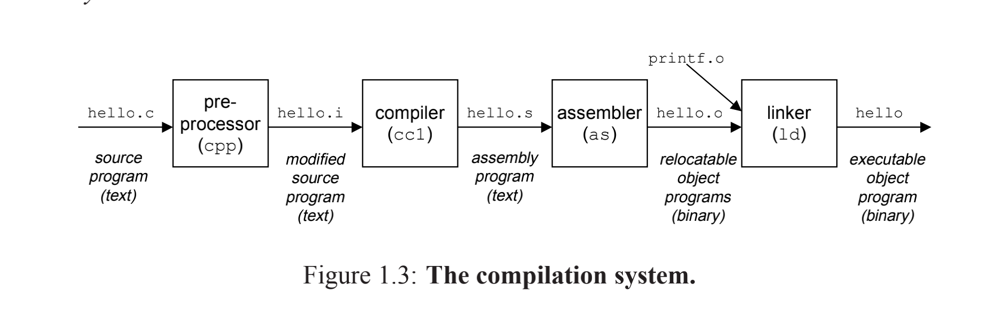
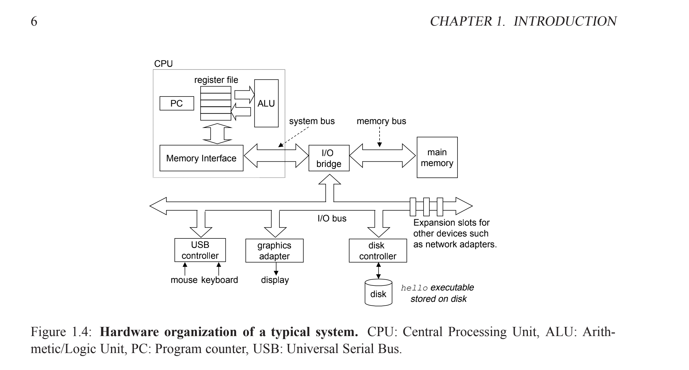

[TOC]
# 生成可执行文件过程

1.将hello.c头部#引入的文件进行拼接，然后生成hello.i
2.将hello.i用gcc编译器编译成汇编语言hello.s
3.汇编翻译器转化为二进制文件hello.o
4.linker进行多个文件拼接，然后生成可执行文件hello
# 为什么学习汇编？
1.优化代码
2.明白linker-time errors
3.防止安全漏洞

# 硬件结构

## buses
假设一个字4个字节，buses一次传输一个字

we will assume a word size of 4 bytes,and we will assume that buses transfer only one word at a time.

## I/O devices
I/O devices是系统连接外部的拓展
Input/output (I/O) devices are the system’s connection to the external world

控制器是设备本身的芯片组，或者是在系统的主电路板（通常叫做母板）
适配器是一个卡带，插在母板里面
Controllers are chip sets in the device itself or on the system’s main printed circuit board (often called the motherboard). An adapter is a card that plugs into a slot on the motherboard.

不管每个外借设备的目的是什么，都是为了在`I/O bus`和`I/O devices`之间传递信息

## Main memory
Main memory是零时存储设备，当cpu执行程序的时候，保持对程序和数据的操作

The main memory is a temporary storage device that holds both a program and the data it manipulates
while the processor is executing the program.