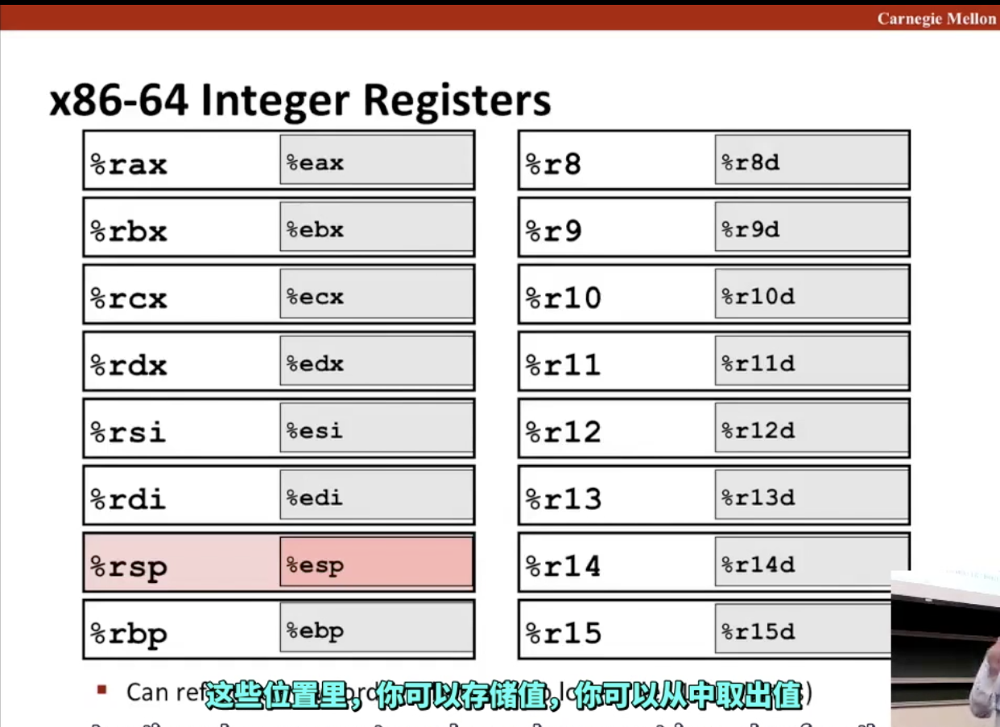
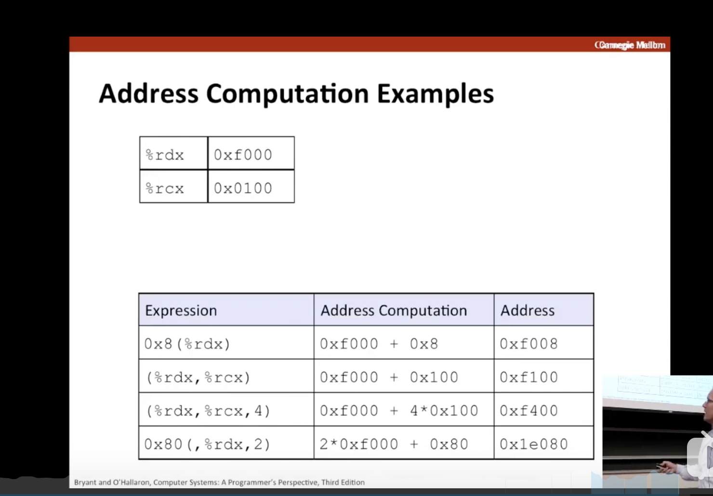

[TOC]
# 生成可执行文件过程

1.将hello.c头部#引入的文件进行拼接，然后生成hello.i
2.将hello.i用gcc编译器编译成汇编语言hello.s
3.汇编翻译器转化为二进制文件hello.o
4.linker进行多个文件拼接，然后生成可执行文件hello
# 为什么学习汇编？
1.优化代码
2.明白linker-time errors
3.防止安全漏洞


# 硬件结构

## buses
假设一个字4个字节，buses一次传输一个字

we will assume a word size of 4 bytes,and we will assume that buses transfer only one word at a time.

## I/O devices
I/O devices是系统连接外部的拓展
Input/output (I/O) devices are the system’s connection to the external world

控制器是设备本身的芯片组，或者是在系统的主电路板（通常叫做母板）
适配器是一个卡带，插在母板里面
Controllers are chip sets in the device itself or on the system’s main printed circuit board (often called the motherboard). An adapter is a card that plugs into a slot on the motherboard.

不管每个外借设备的目的是什么，都是为了在`I/O bus`和`I/O devices`之间传递信息

## Main memory
Main memory是零时存储设备，当cpu执行程序的时候，保持对程序和数据的操作

The main memory is a temporary storage device that holds both a program and the data it manipulates
while the processor is executing the program.

## Processor
处理器是存储在main memory的指令的引擎。在处理器核心是一个字大小的存储设备，叫做程序计数器。
The central processing unit (CPU), or simply processor, is the engine that interprets (or executes) instructions stored in main memory. At its core is a word-sized storage device (or register) called the program counter (PC). At any point in time, the PC points at (contains the address of) some machine-language instruction in main memory.

程序计数器从被指针指向的内存中读取指令，然后解释命令并执行。然后跳转到下一个内存里的指令(没有对应的英文，懒得复制)

There are only a few of these simple operations, and they revolve around main memory, the register file, and
the arithmetic/logic unit (ALU). （懒得翻译了）
### register file
The register file is a small storage device that consists of a collection of word-sized registers, each with its own unique name. 
### the arithmetic/logic unit (ALU)
The ALU computes new data and address values.（懒得翻译了）

### 简单的操作指令
1.Load: Copy a byte or a word from main memory into a register, overwriting the previous contents of the register. 
2.Store: Copy the a byte or a word from a register to a location in main memory, overwriting the
previous contents of that location.  
3.Update: Copy the contents of two registers to the ALU, which adds the two words together and stores
the result in a register, overwriting the previous contents of that register. 
4.I/O Read: Copy a byte or a word from an I/O device into a register.
5.I/O Write: Copy a byte or a word from a register to an I/O device.
6.Jump: Extract a word from the instruction itself and copy that word into the program counter (PC),
overwriting the previous value of the PC.

### hello程序执行流程
当输入./hello执行以后，将硬盘中的代码传输到内存，寄存器从内存读取指令，处理结果给内存，然后内存告诉显示器i/o，显示hello world


# 机器语言

## 汇编
### 生成汇编文件main.s
```
gcc -Og -S main.c
```
-O代表代码优化，g代表方便阅读的汇编优化
结果:
```
	.file	"main.c"
	.section	.rodata.str1.1,"aMS",@progbits,1
.LC0:
	.string	"Hello, World!"
	.text
	.globl	main
	.type	main, @function
main:
.LFB11:
	.cfi_startproc
	subq	$8, %rsp
	.cfi_def_cfa_offset 16
	movl	$.LC0, %edi
	call	puts
	movl	$0, %eax
	addq	$8, %rsp
	.cfi_def_cfa_offset 8
	ret
	.cfi_endproc
.LFE11:
	.size	main, .-main
	.ident	"GCC: (GNU) 4.9.4"
	.section	.note.GNU-stack,"",@progbits
```
### 生成二进制文件main.o
```
gcc -Og -c main.c
```
### 反编译
```
objdump -d main.o
```
输出结果:
```
main.o:     file format elf64-x86-64

Disassembly of section .text:

0000000000000000 <main>:

   0:	48 83 ec 08          	sub    $0x8,%rsp

   4:	bf 00 00 00 00       	mov    $0x0,%edi

   9:	e8 00 00 00 00       	callq  e <main+0xe>

   e:	b8 00 00 00 00       	mov    $0x0,%eax

  13:	48 83 c4 08          	add    $0x8,%rsp

  17:	c3                   	retq   
```

## 寄存器

当汇编使用左侧类似%rax白色区域的存储时，用的是64位存储。使用右侧灰色部分的时候，是32位存储

## 地址计算
