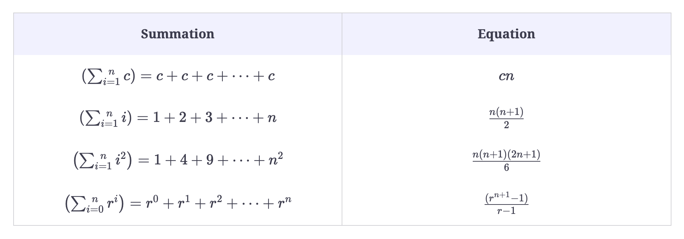

[TOC]
# Big-O Notation
## Useful Formulae


## Common Complexity Scenarios
```
for (int x = 0; x < n; x++) {
    //statement(s) that take constant time
}
```
once time: x=1
loop times: n (from 0 to n-1)
last time: sum = sum+n+1
sum = 