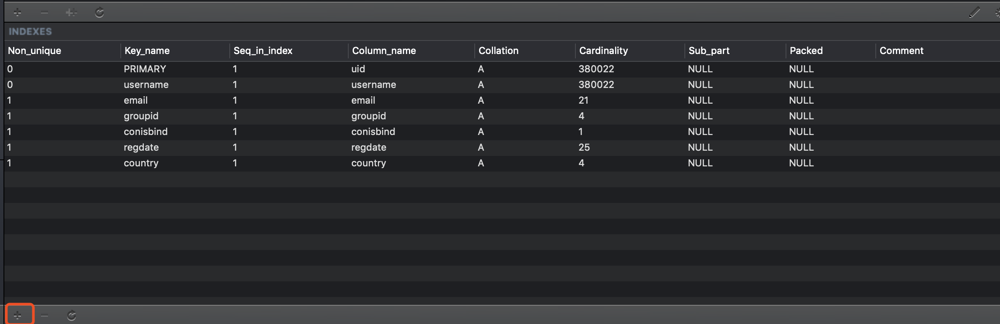
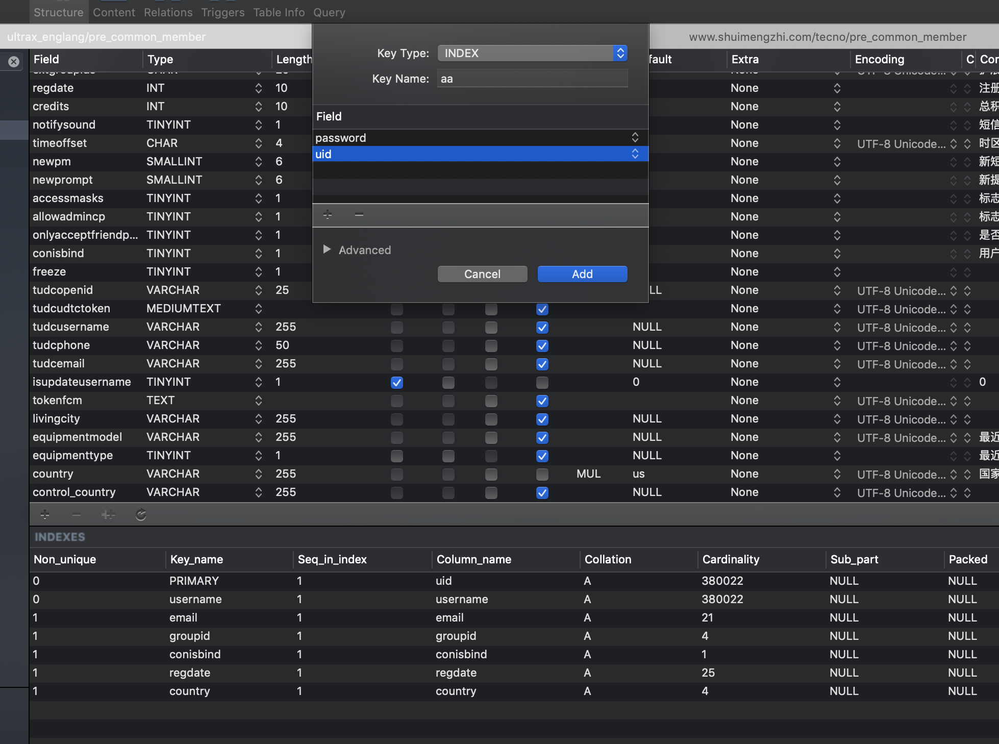

普通索引
B-Tree
一般读取数据库是一行一行的读，而使用索引则可以按列读取，然后读取到符合条件的时候，再读取那一行。
一个索引可以包含多个列，如果添加索引时，添加的最左侧的那列不在搜索访问，那么这整个索引就不会用到。
索引读取顺序是从索引最左侧的列开始读取，因此越频繁使用的搜索列越排左会更好。

添加索引

index代表添加索引，索引名字叫做aa，最常用的是password,其次是uid。查询的时候如果只有uid没有password，则不会引用到aa的索引