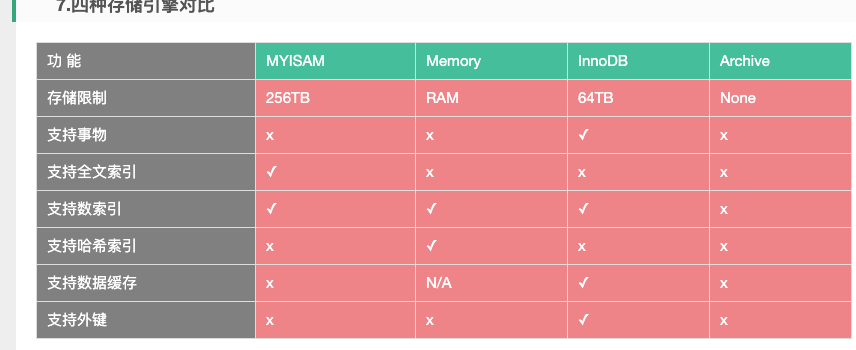

[TOC]
## 普通索引
B-Tree
一般读取数据库是一行一行的读，而使用索引则可以按列读取，然后读取到符合条件的时候，再读取那一行。
一个索引可以包含多个列，如果添加索引时，添加的最左侧的那列不在搜索访问，那么这整个索引就不会用到。
索引读取顺序是从索引最左侧的列开始读取，因此越频繁使用的搜索列越排左会更好。

## 添加索引


index代表添加索引，索引名字叫做aa，最常用的是password,其次是uid。查询的时候如果只有uid没有password，则不会引用到aa的索引
```
explain 查询语句
```
预估查询语句搜索行数，以及使用到的索引，进行粗略的判断是否需要优化查询
##查询优化
>1.查询的时候尽量不用联表，数据之间的连接在代码层面来进行存储连接
>2.如果查询的结果过大，不要使用缓存查询（用mysql_unbuffered_query()）,因为平时查询机制是查询过程中将结果放入缓存，然后查询完后，一口气抛给请求数据的地方。客户端与mysql服务端是半双工的通讯方式，只能一方发送，另一方接受。或者与之相反。

##事务锁

> 执行数据库查询命令的时候，有可能部分执行成功，部分失败。比如两张表，一张记录扣了多少钱，一张记录买到什么东西。如果扣了多少钱的那张表执行成功了，而买东西的表记录失败了，那么就会出现有了白花钱的情况。为了防止这种事情的发生，需要将两者表的查询绑定，当全部执行成功时才返回数据。具体百度：事务锁

## 设计表结构

> 用MyISAM引擎时别用允许null存在，因为索引的时候null不好判断null的类型，并且不好进行比较。不过null的优化对于速度提升比较小。InnoDB引擎则无所谓null

##各引擎比较图


### 1.InnoDB

```
InnoDB官方特点描述是“支持事务，行级锁定和外键”。是事务型数据库的首选引擎，支持事务安全表 (ACID)，支持行锁定和外键。MySQL5.5.5 之后，InnoDB作为默认存储引擎。如果要提供提交、回滚、崩溃恢复能力的事务安全（ACID兼容）能力，并要求实现并发控制，InnoDB是一个好的选择。
```

### 2.MyISAM

```
MyISAM基于ISAM的存储引擎，并对其进行扩展。它是在Web、数据存储和其他应用环境下最常用的存储引擎之一。拥有较高的插入、查询速度，但不支持事务。在 MySQL5.5.5之前的版本中，MyISAM 是默认存储引擎。如果数据表主要用来插入和查询记录，则MyISAM引擎能提供较高的处理效率
```


### 3.MEMORY

```
MEMORY官方特点描述是“基于散列，存储在内存中，对临时表有用”。该存储引擎将表中的数据存储到内存中，为查询和引用其他表数据提供快速访问。不支持事务和外键。如果只是临时存放数据，数据量不大，并且不需要较高的数据安全性，可以选择将数据保存在内存中的Memory引擎，MySQL中使用该引擎作为临时表，存放查询的中间结果。
```


### 4.Archive

```
Archive支持高并发的插入操作，但是本身不是事务安全的。Archive非常适合存储归档数据，如记录日志信息可以使用Archive。如果只有INSERT和SELECT操作，可以选择Archive。
```


