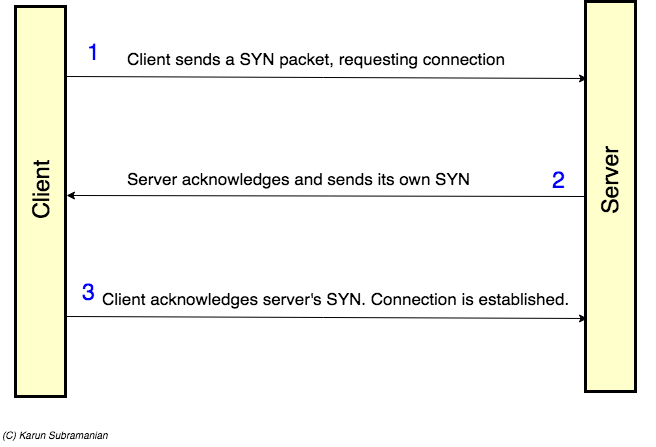

[TOC]
#php 输出缓冲区(output buffer)
主要作用就是将数据传输一次性发送而不是一个字节一个字节的发送，减少层与层之间的数据交换次数对性能提升有帮助
#网络协议

#TCP
TCP属于`传输层`，应用层将`数据流`传输给TCP,TCP将数据流分区成`报文段`，之后把结果包发给IP层。IP通过网络发送给另一端的TCP层。另一端的TCP层接收到数据包，将状态结果发送回去，如果没有发送回去，那么TCP发送端又会再发送一次给接收端`数据包`。
#TCP三次握手建立连接(three-way handshake)

1.First client sends a TCP segment with SYN control bit (synchronize) set.
2.If server receives client’s data (Yay!!), it sends acknowledgement along with its own SYN request.
3.Client sends acknowledgement. Connection is established.