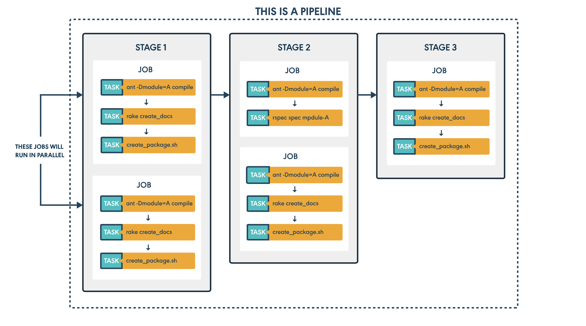

# Agent
what is agent?
The server doesn't do any work.It provides work for the agents to do.

# material 
what is material ?
material is a case for a pipline to "trigger".Or to start doing what it is configured to do. 

# pipeline 
what is phpeline ?
It is a workflow.

# Stages, jobs and tasks


A pipeline consists of one or more "stages", each stage consists of one or more "jobs" and each job is made up of one or more "tasks". All of these are modeling constructs within a pipeline.

Struct like this: 
```
pipeline {
    stages {
        jobs {
            tasks : command or ./build 
        },
        jobs {
            tasks : command or ./build
        },
        jobs {
            tasks : command or ./build
        },
        .....
    },
    stages {
        jobs {
            tasks : command or ./build
        },
        jobs {
            tasks : command or ./build
        },
        jobs {
            tasks : command or ./build
        },
        .....
    },
    stages {
        jobs {
            tasks : command or ./build
        },
        jobs {
            tasks : command or ./build
        },
        jobs {
            tasks : command or ./build
        },
        ....
    },
    ......
}
```

## Tasks  

Tasks usually are commands or script like "./build" script .
The script (./build ) is configuration.

It works type  is one by one,and once a task is failed .Others also are failed.You must be all tasks running is OK .