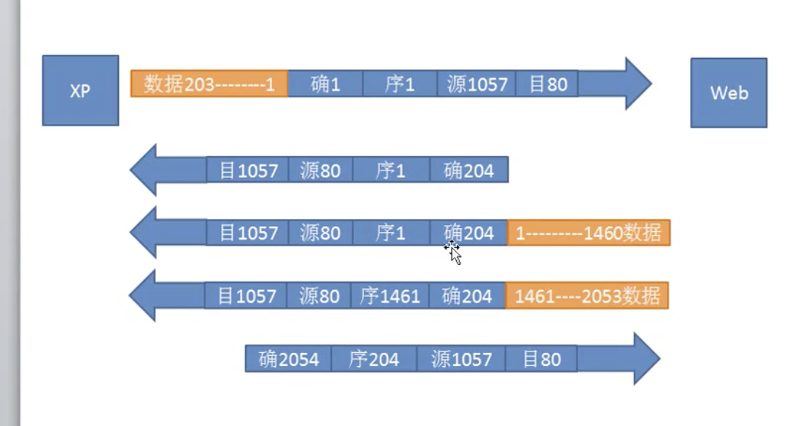
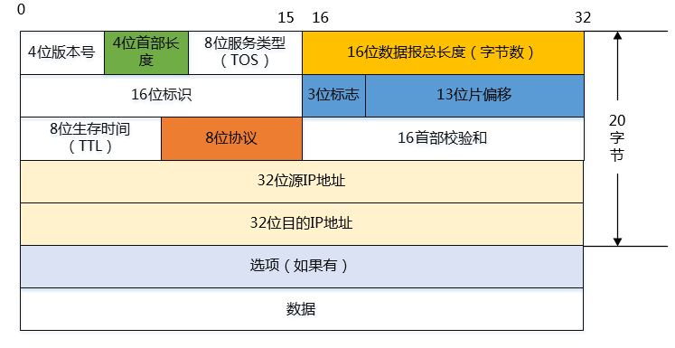

[TOC]
# osi模型参考
## 应用层
产生网络流量的程序

## 表示层
传输之前进行加密或二进制压缩，接收的时候解密或二进制解压

## 会话层
查看应用的会话，

## 传输层
tcp udp
### TCP抓包

序号：发送给另一端数据的字节的开头位数
确认号 ：另一端发送过来的数据字节结尾的位数加一

### 查看会话
netstat -n
netstat -nb 看哪一个进程建立的会话
## 网络层
规划最佳传输路径 ip协议
不负责排序，不负责重传判断，只管传输

### ip

#### TOS区分服务
可以在ip头部添加区分服务标签，来进行包发送的优先级

#### 标识（identification）
：占16位。IP软件在存储器中维持一个计数器，每产生一个数据报，计数器就加1，并将此值赋给标识字段。

但这个“标识”不是序号，因为IP是无连接服务，数据报不存在按序接收的问题。当数据报由于长度超过网络的MTU而必须分片时，这个标识字段的值就被复制到所有的数据报片的标识字段中。相同的标识字段的值使分片后的各数据报片最后能正确地重装成为原来的数据报。

#### 标志
ip包传到链路层有的包太大，就需要分片。3位标志就是用来标记分片用的。
最后一位为1，代表后面还有`分片`，如果为0，则表示最后一个分片。第二位为0时代表允许分片

#### 片偏移
偏移量计算：偏移=字节/8
片还原的时候  偏移量*8=字节的位置，这个字节的位置来进行定位拼接

#### TTL
数据包生存时间，每跳一个路由减一，直到为零，则被抛弃

### 子网掩码
为了确定子网的ip，
比如
ip:10.0.0.0
子网掩码:255.0.0.0
则说明ip是10段，子网在这个基础上后三位随便变
10.1.2.1
子网掩码:255.255.0.0
ip则是10.0，子网后两位随便变
10.0.2.1

### ICMP协议
ping的时候用的最多，用来排除网络故障用的，报错什么的
### IGMP
分组广播协议
## 链路层
定义0、1数据的开始结束，以及意义，检查传输过程中是否出错，
出错就丢掉.

如何检测出错呢？
链路层会在头部写入数据包的和值，接收方根据这个头部值，再对数据包进行验算，看结果值是否和头部的值一样。
### CSMA/CD
局域网使用。监听信道是否有数据传输。防止数据冲突
## 物理层
接口标准、电气标准

# OSI故障排查
## 物理层故障
1.查看连接状态
2.查看接收包和发送包

## 链路层故障
1.mac地址有问题 
2.欠费
3.网速不一致
4.计算机连接到其他地方的vlan

## 网络层故障
1.网关配置问题，
2.配置了错误的ip地址
3.子网掩码
4.路由器没有配置目标地址的ip

## ADSL
非对称数字环路，上传速度和下载速度不对称

# 交换机
网桥是交换机的前身，具有学习功能，记录mac地址的位置。
交换机可以针对性的传输数据，而不会像集线器一样接受数据全部分发给子网络下的所有计算机。
交换机还具有存储发送数据的能力，也就是排队功能，让数据有顺序的转发给子网络下的其他的计算机。